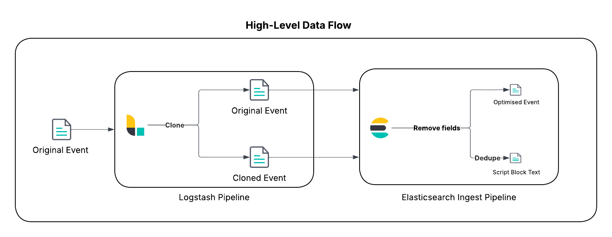

# **Cost-Effective Logging with ES|QL LOOKUP JOIN**

This repository provides the artefacts for the solution outlined in this [blog](PLACEHOLDER_LINK). This repository contains the proof-of-concept (PoC) code and configuration files to implement a data-deduplication strategy using the Elastic Stack, the example target dataset is PowerShell Script Block logs (Event ID 4104) that haven't been segmented. The pattern demonstrated can significantly reduce the storage footprint of repetitive script text without losing forensic context, leveraging the power of ES|QL `LOOKUP JOIN`.

## **🚨 IMPORTANT DISCLAIMER 🚨**

This solution is a **Proof-of-Concept** designed to demonstrate the capabilities of the Elastic Stack. It utilises the **ES|QL LOOKUP JOIN command**, which is in **Technical Preview** as of Elasticsearch 8.18. Features in Technical Preview are not subject to the support SLA of official GA features and may change in future releases.

## **Architecture Overview**

The data flow follows an "enrich at query time" model:

1. PowerShell logs (Event ID 4104) are sent to Logstash.  
2. The Logstash clone filter creates two copies of each event.  
3. The events are sent to an Elasticsearch ingest pipeline.  
4. **The Original Event** is stripped of its bulky script text, becoming a "lean event" containing only metadata (user, host, timestamp, etc.) and the script's hash. It is stored in a standard data stream.  
5. **The Cloned Event** is stripped of all non-relevant metadata, and its document _id is set to the script's hash. This creates a "lookup document" containing only the unique script text and its hash. It is stored in a single-shard lookup index, where duplicates are automatically overwritten.  
6. At query time, an analyst uses **ES|QL LOOKUP JOIN** to seamlessly combine the lean event metadata with the full script text from the lookup index.

## **Prerequisites**

* **Elastic Stack >= 8.18:** An environment with Elasticsearch and Kibana.  
* **Logstash:** A running Logstash instance to process the logs.  
* **PowerShell Logging Enabled:** PowerShell Script Block Logging (Event ID 4104) must be enabled on your Windows endpoints. This is typically configured via Group Policy.
* **Elastic Agent/Winlogbeat:** A method to ship Windows Event Logs to your Logstash instance. The configuration assumes data is compliant with the Elastic Common Schema (ECS).
****Logstash**: This solution will leverage Logstash to duplicate the relevant event before it is optimised. Follow the official documentation to set it up if you don’t have this deployed.  
**Understand your data**: This solution focuses on PowerShell script blocks that are not segmented due to the size limit of Event Tracing for Windows (ETW) events. Review your data over a meaningful timeframe to understand the potential benefit in your environment.
Use this sample Kibana Query Language (KQL) search to understand the volume of target data in your environment - `event.module: "windows" and event.dataset: "windows.powershell_operational" and event.code: 4104 and powershell.total: 1`. 

## **High-Level Setup Instructions**

### **1. Configure PowerShell Logging**

Ensure PowerShell Script Block Logging is enabled via GPO:  
Computer Configuration > Administrative Templates > Windows Components > Windows PowerShell > Turn on PowerShell Script Block Logging

### **2. Apply Component and Index Templates**

These templates create the necessary mappings and configure the lookup index mode. Apply them via Kibana Dev Tools or cURL.

### **3. Configure the Logstash Pipeline**

Create a logstash.conf file with the following input, filter, and output sections. Replace the elasticsearch output details with your cluster's configuration.

### **4. Create the Ingest Pipeline**

The Elastic Integration for Windows ships with a default pipeline. We will create a custom pipeline that it calls. This pipeline performs the conditional transformations. Apply this using Kibana Dev Tools.

### **5. Verify the Data Flow**

After configuring the components, send some PowerShell logs through the system.

* Check the logs-windows.powershell_operational_lookup-default index. It should contain a small number of documents, each with a script hash, script text, and minimal metadata.  
* Check the logs-windows.powershell_operational-default_reduced data stream. It should contain a large number of lean events, without the script_block_text field but with the script_block_hash field populated.